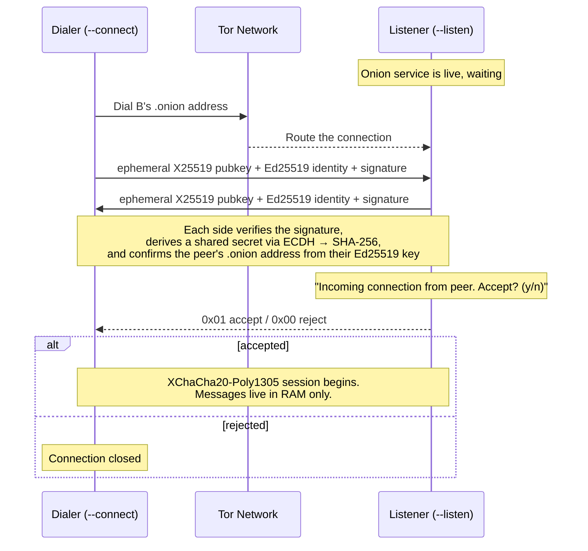

# Veil

```
  ██╗   ██╗███████╗██╗██╗
  ██║   ██║██╔════╝██║██║
  ██║   ██║█████╗  ██║██║
  ╚██╗ ██╔╝██╔══╝  ██║██║
   ╚████╔╝ ███████╗██║███████╗
    ╚═══╝  ╚══════╝╚═╝╚══════╝

  ephemeral. encrypted. untraced.
```

[](LICENSE.md)


**Veil is a peer-to-peer, terminal-native messaging app with no accounts, no servers, and no message history.** Two people, two `.onion` addresses, one live encrypted session — and when it ends, there's nothing left behind to find.

> ⚠️ **Experimental, unaudited, personal project.** Veil is built on well-regarded cryptographic primitives, but the implementation hasn't been independently reviewed. Read [Security Model](#security-model) before relying on it for anything that matters.

## Table of Contents

- [Why Veil](#why-veil)
- [Features](#features)
- [How It Works](#how-it-works)
- [Getting Started](#getting-started)
- [Usage](#usage)
- [What Gets Stored Where](#what-gets-stored-where)
- [Security Model](#security-model)
- [Tech Stack](#tech-stack)
- [Project Status & Roadmap](#project-status--roadmap)
- [Contributing](#contributing)
- [License](#license)
- [Acknowledgments](#acknowledgments)

---

## Why Veil

Most messaging apps ask you to hand over a phone number, trust a company's servers with your history, and hope that infrastructure never gets subpoenaed, breached, or quietly modified. Veil is built around a different bet: **if there's no account and no server, there's nothing to hand over.**

Your identity is a keypair, not a phone number. Your address is a Tor `.onion` service, not a row in someone's database. Conversations happen live, directly between two peers, and exist only in memory — when the session ends, so does the record of it.

It's built for the terminal on purpose: no read receipts, no reactions, no algorithmic anything. Just two consenting peers and a slice of Tor's network in between.

In practice, a session looks something like this:

```text
INCOMING CONNECTION FROM: xergprunqc76vmfnbas7szjteqmyeg7mpkdqwi6rjg36ryrmn57a.onion

Accept? [y/n]: y

E2EE session established with PEER. Type /add <name> to save this contact.
PEER: hey, it's me
YOU: /add sam
✓ Contact saved: "sam" → xergprunqc76vmfnbas7szjteqmyeg7mpkdqwi6rjg36ryrmn57a.onion
YOU: good, now I don't have to remember that address
```

---

## Features

- 🔑 **Keypair identity, not a phone number.** Your Ed25519 keypair *is* your account. Your public key deterministically becomes your Tor v3 `.onion` address — nothing to register, no central directory that knows who you are.
- 🧅 **No server, ever.** Veil routes exclusively over Tor onion services. No relay, no metadata broker, no company in the middle — and no NAT/CGNAT/port-forwarding headaches, since Tor handles all of that for you.
- 🔒 **Real end-to-end encryption on top of Tor.** Every session negotiates a fresh X25519 shared secret (authenticated by your long-term Ed25519 identity) and encrypts every message with XChaCha20-Poly1305. Tor hides *who's* talking; Veil's own layer makes sure only the two of you can read *what's* said.
- 👋 **You have to answer the door.** Veil is session-based, not store-and-forward. An incoming connection shows you exactly who's calling — by address, or by nickname if you've saved them — and waits for `y` or `n`. Nothing is exchanged until you accept.
- 🕵️ **Nothing survives the session.** Messages live in RAM for the duration of the chat and are never written to disk. Close the session, and the conversation is gone — nothing to seize, nothing to leak.
- 🗝️ **Your identity persists, protected by a passphrase.** Your private key survives across launches (so people can actually reach you twice), encrypted at rest with Argon2id + XChaCha20-Poly1305 behind a master passphrase you choose on first run.
- 🔥 **Or skip persistence entirely.** `--burner-mode` spins up a random, one-time identity that lives only in memory — no passphrase prompt, nothing touches disk.
- 📇 **Optional local contacts.** `/add <nickname>` and `/remove <nickname>` save people you trust to a local address book, so you don't have to memorize or re-paste 56-character onion addresses.
- 🛡️ **Built-in MITM detection.** Your `.onion` address is cryptographically derived from your identity key, and Veil verifies that binding on every connection — if the peer that answers doesn't match the address you dialed, the connection is aborted.
- 🖥️ **A real terminal UI, not a wall of text.** A Bubble Tea–powered interface with a scrollable chat viewport, dedicated input box, and animated loading states — plus a hybrid CLI/TUI design: launch with no arguments for an interactive menu, or pass flags for one-shot, script-friendly usage.
- 📦 **One self-contained binary.** Tor itself is embedded directly into the compiled executable. No separate Tor install, no PATH configuration — download one file and run it.

---

## How It Works

### Identity

There's no sign-up. On first run, Veil generates an Ed25519 keypair and asks you to set a master passphrase. Your public key is deterministically converted into a Tor v3 `.onion` address — that address *is* your account, and it stays the same as long as you keep the same identity.

Your private key is encrypted at rest (see [Security Model](#security-model)) and saved to `~/.veil/identity.key`. Every future launch asks for your passphrase, decrypts the key into memory, and you're back online under the same address.

### Discovery & Connection

Veil doesn't use a DHT, a directory server, or IP broadcasting to help peers find each other — it doesn't need to. A Tor `.onion` address *is* the routing information. To reach someone, you just need the address they've shared with you out of band (or a saved nickname):

```powershell
.\veil.exe --connect <their-address>.onion
```

Tor handles the rest — routing, hole-punching, and hiding both parties' real IP addresses. Nothing to configure, no ports to forward, and CGNAT is a non-issue.

### The Handshake

The moment a connection reaches a listening peer, both sides perform an application-layer handshake before any chat happens:



If the address that answers doesn't cryptographically match the address you dialed, Veil aborts the connection and flags it as a possible MITM rather than silently connecting you to the wrong peer.

### Encryption

Tor already encrypts traffic in transit, but Veil adds its own layer on top so that *only the two endpoints* — not any relay along the Tor circuit — can read a message:

- **Key agreement:** a fresh X25519 keypair is generated for every session and discarded when it ends. The resulting shared secret is unique per session, so compromising one conversation's key doesn't expose past or future ones.
- **Authentication:** each side signs its ephemeral key with its long-term Ed25519 identity, so you know you're actually talking to the person whose address you dialed — not just whoever happened to answer.
- **Message encryption:** every message is sealed individually with XChaCha20-Poly1305 using a fresh random 24-byte nonce, framed with a length prefix. If a message is tampered with in transit, the authentication tag fails to verify and Veil flags it instead of displaying corrupted plaintext.

### Session Model

Veil is deliberately **synchronous-only**. There's no store-and-forward, no offline mailbox, no message queue sitting on a server somewhere. If the person you're trying to reach isn't running Veil and listening right now, you simply can't connect — the same way you can't have a phone call with someone who hasn't picked up.

That's a design choice, not a missing feature: it means there is never a server, cache, or intermediary holding your messages while you're offline. The trade-off is that both people have to be online at the same time.

---

## Getting Started

### Requirements

- **Windows** — the only supported platform right now (cross-platform builds are [on the roadmap](#project-status--roadmap))
- **Go** — developed and tested with Go 1.26
- **A `tor.exe` binary** in the project root at build time, for `go:embed` to bundle into the final executable. This repo already tracks one; if it's ever missing, grab it from the [Tor Project's Expert Bundle](https://www.torproject.org/download/tor/) or a Tor Browser install.

### Build from source

```bash
git clone https://github.com/GNU-LuxTech/Veil.git
cd Veil
go build -o veil.exe
```

`go:embed` bakes `tor.exe` directly into the resulting binary at compile time, so the output is a single, fully self-contained, portable executable. Hand `veil.exe` to someone else and it just runs — no Go, no Tor, no setup on their end.

---

## Usage

### Launch modes

Run it with no arguments for the interactive menu:

```powershell
.\veil.exe
```

Use the arrow keys to choose **Host a Chat** or **Join a Chat**.

Or skip straight past the menu with flags — handy for muscle memory or scripting:

```powershell
.\veil.exe --listen                       # host a chat
.\veil.exe --connect <address>.onion      # join a chat
.\veil.exe --burner-mode                  # one-time identity, nothing saved to disk
```

`--burner-mode` can be combined with `--listen` or `--connect` for a fully ephemeral, one-off session.

### First run

The first time you launch Veil (outside of `--burner-mode`), it asks you to create a master passphrase. This generates your Ed25519 identity and encrypts it to disk — see [What Gets Stored Where](#what-gets-stored-where). Every launch after that asks you to unlock it with the same passphrase.

### Hosting a chat

1. `.\veil.exe --listen` (or select **Host a Chat** from the menu)
2. Veil boots an embedded Tor daemon (30–60 seconds on first launch) and prints your `.onion` address
3. Share that address with the person you want to talk to, out of band
4. When they connect, you'll see `INCOMING CONNECTION FROM: <address or nickname>` — press `y` to accept, `n` to reject

### Joining a chat

1. `.\veil.exe --connect <address>.onion` (or select **Join a Chat** and paste, or pick a saved contact)
2. If you have saved contacts, `Tab` toggles focus between the contacts list and the address input box
3. Wait for the host to accept

### In a chat

| Command | Effect |
|---|---|
| *(type and hit Enter)* | Send an encrypted message |
| `/add <nickname>` | Save the current peer to your local contacts |
| `/remove <nickname>` | Delete a saved contact by nickname |
| `Esc` / `Ctrl+C` | Cleanly close the session and shut down Tor |

Once you've saved someone with `/add`, their nickname shows up automatically the next time they connect — no need to add them again.

---

## What Gets Stored Where

Everything Veil writes to disk lives under `~/.veil/`:

| Path | What it holds | Protected by |
|---|---|---|
| `~/.veil/identity.key` | Your Ed25519 private key | Argon2id + XChaCha20-Poly1305, behind your master passphrase — never written in `--burner-mode` |
| `~/.veil/contacts.json` | Nickname → `.onion` address map | OS file permissions only — **not encrypted** |
| `~/.veil/tor-listen/` | Tor daemon data, logs, and the self-extracted `tor.exe` (host role) | OS file permissions |
| `~/.veil/tor-connect/` | Same, for the joining role | OS file permissions |
| *(nothing)* | Chat messages | **Never written to disk** — they exist only in memory for the life of the session |

Worth calling out explicitly: **your contacts file is plaintext.** It's a convenience feature protected by normal filesystem permissions, but it isn't encrypted the way your identity key is. If your device is compromised, your saved contact list is readable.

---

## Security Model

Veil is built on standard, well-regarded primitives — Ed25519, X25519 (ECDH), XChaCha20-Poly1305 (AEAD), Argon2id (KDF), and Tor v3 onion services for transport. It has **not** gone through an independent security audit. Treat it as an actively-developed personal project, not a hardened tool to bet your safety or liberty on.

**What Veil is designed to protect against:**

- **Message content exposure** — every message is end-to-end encrypted with a per-session key that isn't recoverable from your long-term identity key alone.
- **Metadata to a central party** — there is no server, so there's no company, database, or single point of failure to compel, breach, or subpoena.
- **IP address disclosure** — Tor onion services mean neither peer ever learns the other's real IP address.
- **Impersonation / MITM** — your `.onion` address is cryptographically bound to your Ed25519 key, and Veil verifies that binding on every connection.
- **Data seizure after the fact** — chat messages are never written to disk, so there's nothing on your device to recover once a session ends.

**What it does *not* (yet) protect against:**

- **Traffic analysis by a well-resourced observer.** Veil doesn't currently implement traffic padding or cover traffic. Someone watching both ends of a connection may still be able to tell *that* two parties are communicating, even without knowing *what* was said.
- **Endpoint compromise.** If your device is compromised while a session is active, your messages are readable in memory, same as any application.
- **A weak or reused master passphrase.** Argon2id makes offline brute-forcing expensive, but it can't save a passphrase that's guessable to begin with.
- **Your contacts list**, which is stored in plaintext — see [above](#what-gets-stored-where).
- **Formal verification.** The handshake and protocol have been designed and reviewed by the author, not audited by a third party.

If your threat model involves a well-resourced, state-level adversary, treat Veil as one layer of caution among several — not a complete answer on its own.

---

## Tech Stack

| Layer | Technology |
|---|---|
| Language | Go |
| Identity | Ed25519 keypairs |
| Transport | Tor v3 Onion Services, via [`cretz/bine`](https://github.com/cretz/bine) |
| Session handshake | X25519 (ECDH) + Ed25519 signatures |
| Message encryption | XChaCha20-Poly1305 (AEAD) |
| Identity-at-rest encryption | Argon2id (KDF) + XChaCha20-Poly1305 (AEAD) |
| Terminal UI | [Bubble Tea](https://github.com/charmbracelet/bubbletea), [Bubbles](https://github.com/charmbracelet/bubbles), [Lipgloss](https://github.com/charmbracelet/lipgloss) |
| Distribution | Go `embed` (Tor baked directly into the compiled binary) |

---

## Project Status & Roadmap

Veil is a work in progress, built as a hands-on way to learn Go alongside the project itself.

**Done:**

- [x] Ed25519 identity with deterministic `.onion` address derivation
- [x] Embedded Tor daemon — onion service hosting and dialing
- [x] X25519 handshake with Ed25519-signed authentication and MITM detection
- [x] XChaCha20-Poly1305 end-to-end message encryption
- [x] Accept/reject prompt for incoming connections
- [x] Full Bubble Tea terminal UI with hybrid CLI/TUI (flags fast-track past the menu)
- [x] Persistent identity, encrypted at rest with Argon2id + XChaCha20-Poly1305
- [x] `--burner-mode` for one-time, disk-free identities
- [x] Local contact/nickname system (`/add`, `/remove`)
- [x] Single self-contained binary via `go:embed`

**Planned:**

- [ ] `/send` — file transfer over an active session
- [ ] `--auto-accept` — whitelist trusted addresses to skip the accept prompt
- [ ] Opt-in, encrypted local session transcripts
- [ ] Custom `--help` output
- [ ] Cross-platform builds — Linux, macOS, Android (Termux)
- [ ] Traffic padding / cover traffic
- [ ] Independent security audit

---

## Contributing

Veil is young, and the areas that would benefit most from outside eyes are exactly the ones that matter most in a privacy tool: the handshake logic and the identity-at-rest encryption. Bug reports, feature suggestions, and pull requests are welcome. If you find a security-relevant issue, please open an issue, or reach out to the maintainer directly first if it's sensitive enough to warrant private disclosure.

This is a solo project, so response times may vary — but every contribution gets read.

---

## License

Veil is licensed under the **GNU General Public License v3.0**. See [`LICENSE.md`](LICENSE.md) for the full text.

In short: you're free to use, study, modify, and redistribute Veil, including commercially — but if you distribute a modified version, it has to stay open under the same license. For a privacy tool, that's not a legal footnote: **anyone can audit exactly what Veil does**, and no one can quietly fork it into a closed-source, unverifiable product.

---

## Acknowledgments

- The [Tor Project](https://www.torproject.org/), for the network and onion service protocol this app is built on
- [`cretz/bine`](https://github.com/cretz/bine), the Go Tor controller that makes embedding and driving Tor from Go possible
- [Charm](https://charm.sh/)'s Bubble Tea ecosystem, for making a terminal UI this pleasant to build
- Signal, Briar, Cwtch, and Session — prior art in P2P and metadata-resistant messaging that shaped how Veil approaches identity and threat modeling
